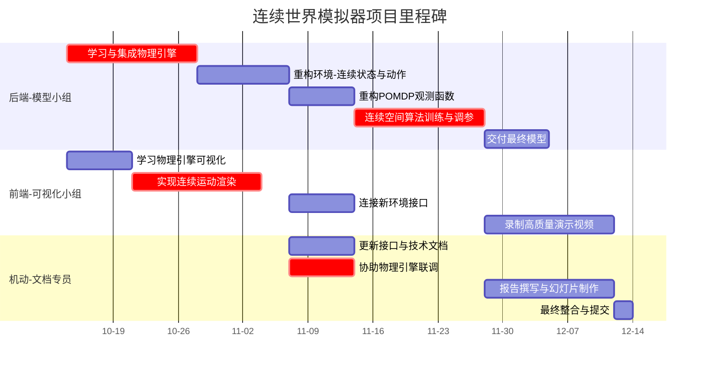

# **「智能生态模拟器：基于POMDP与多智能体强化学习的连续世界模拟」**

## **一、 项目核心摘要**

*   **项目名称**： 智能生态模拟器：基于POMDP与多智能体强化学习的连续世界模拟
*   **项目目标**： 开发一个在**连续2D物理空间**中运行的生态系统模拟器。生物具备**自由移动能力**，通过多智能体强化学习在部分可观测环境下进化其生存策略，旨在涌现出更复杂、更真实的动态行为（如追击、逃窜、包抄等）。
*   **技术核心**： **Ray RLlib** (算法框架) +**PyGame** (轻量级，Python生态，推荐) 或 **Unity ML-Agents** (高表现力，工业级) + **Box2D/pymunk** (物理引擎) + **参数共享** (训练范式)。
*   **最终成果**： 可运行的模拟器程序、训练好的模型、展示训练过程的视频、技术报告和答辩幻灯片。

---

## **二、 理论框架与技术栈**

**1. 动态规划（DP）的理论奠基**

本项目的数学模型完全建立在DP的理论框架之上。我们明确设定了智能体、环境、状态、动作和奖励，以此定义一个马尔可夫决策过程（MDP）。

- **状态 (S) 与动作 (A)**： 智能体的连续坐标、速度、能量及局部环境信息共同构成状态（可能是部分可观测的）。动作空间为连续，如 `[目标前进速度, 目标转向速度]`。
- **奖励 (R) 与目标**： 通过设计进食、繁殖、死亡等奖励信号，明确定义了**最大化累积期望奖励**这一DP与RL共同的核心优化目标。
- **价值函数与贝尔曼方程**： DP中的最优价值函数 `V*(s)`和 `Q*(s,a)`及其服从的贝尔曼最优方程，是本项目智能体追求的终极目标。RL算法中的价值网络（Critic）的核心任务即是**近似这个理论上存在但无法直接计算的最优价值函数**。

**2. 强化学习（RL）的实践求解**

面对连续状态空间、部分可观测性以及未知的环境模型（转移概率 `P`），DP无法直接应用。本项目采用RL方法，作为DP思想在复杂环境中的近似与扩展。

- **函数近似**： 使用神经网络来近似逼近价值函数（Critic网络）和策略（Actor网络），以解决连续空间带来的维数灾难问题。
- **试错与交互**： 智能体通过与环境交互产生的经验（状态、动作、奖励）来学习，无需预先知道环境的完整模型，这正是RL对DP的核心扩展。
- **算法体现**： 采用 **PPO/SAC** 等高级算法。其**Actor-Critic架构**直接对应了DP中的**策略迭代**思想（策略评估+策略改进），但通过经验回放、目标网络等技巧实现了稳定且高效的学习。
- **处理POMDP**： 通过引入**LSTM**等循环网络，使智能体具备记忆能力，整合历史信息以形成对真实状态的内部信念（Belief State），从而在部分可观测环境下做出决策。

**3. 技术栈**

- **物理引擎**： **Box2D** 或 **pymunk**，用于模拟连续空间中的运动、碰撞和力，为RL提供训练环境。
- **学习框架**： **Ray RLlib**，提供工业级的多智能体强化学习实现，支持参数共享、策略映射等高级功能。
- **可视化**： **PyGame** (轻量级，快速开发) 或 **Unity** (高表现力)，用于渲染训练过程并录制演示视频。

**3. 方案特点与价值**

- **理论深度**： 项目并非简单的工程应用，而是深度践行了“**RL是DP在复杂环境中的近似和实践**”这一核心思想，具有扎实的理论基础。
- **技术前沿性**： 综合运用了**连续控制、POMDP、多智能体、参数共享**等高级RL主题，展现了强大的技术整合能力。
- **展示性强**： 动态的生态系统模拟本身极具观赏性，通过训练前、中、后的对比视频，能直观且生动地展示强化学习的效果，极具说服力。

----

## **三、 完整技术栈与架构**

**1. 模拟器环境 (PyGame + Box2D/pymunk)**

*   **世界表示**：
    *   **连续2D空间**： 世界由一个连续的2D平面构成，坐标单位为米（或像素），不再划分为离散网格。
    *   **物理引擎**： 引入轻量级物理引擎（如 **Box2D** 或其Python封装 **pygame2d**，或 **pymunk**）来处理碰撞检测、刚体运动和力的作用，这是实现自由移动和真实交互的基础。
*   **实体属性**：
    *   **状态**： 除了能量、生命值，还包括**连续坐标 (x, y)**、**速度向量 (vx, vy)**、**朝向 (angle)**。
    *   **物理形态**： 每个实体可简化为圆形（拥有半径 `radius`）或矩形，用于碰撞检测。
*   **动作空间 (Action Space)**：
    *   从离散的 `Discrete(5)` 修改为**连续空间**。
    *   **选项A（力与扭矩）**： `Box(low=-1, high=1, shape=(3,))`，输出 `[向前推力, 转向扭矩, 附加动作(如进食)]`。
    *   **选项B（目标速度）**： `Box(low=-1, high=1, shape=(2,))`，输出 `[目标前进速度, 目标转向速度]`。物理引擎将代理平滑地驱动到目标状态。
    *   **推荐使用选项B**，更稳定，易于学习。
*   **观测空间 (Observation Space)**：
    *   **局部感知**： 智能体仍只能感知其周围一定半径内的实体。
    *   **观测表示**： 感知范围内的实体信息（类型、相对距离、相对速度、相对朝向）被编码为一个**固定长度的向量**。如果实体数量不足，用零填充。
    *   **自身状态**： 将自身的能量、速度等信息也纳入观测向量中。
*   **核心规则**：
    *   **移动**： 由物理引擎根据智能体输出的动作（如目标速度）来计算每一帧的新位置和速度。
    *   **交互**： 碰撞检测由物理引擎完成。当两个实体的碰撞体发生重叠时，根据其类型触发交互事件（如进食）。

**2. 强化学习框架 (Ray RLlib) - 适配连续空间**
*   **算法**： **PPO** 或 **SAC**。SAC (Soft Actor-Critic) 通常在处理连续动作空间时表现更佳，但PPO也更强大且稳定。可作为对比实验。
*   **配置**：
    
    ```python
    from ray.rllib.algorithms.sac import SACConfig
    # 或 from ray.rllib.algorithms.ppo import PPOConfig
    
    config = (
        SACConfig() # 使用SAC算法
        .environment(env_creator)
        .multi_agent(...) # 多智能体配置不变
        .training(
            # 针对连续空间调整超参数
            learning_rate=3e-4,
            tau=0.005, # SAC特有，软更新参数
            # ... 其他参数
        )
        .resources(num_gpus=0)
    )
    ```
*   **网络架构**： 策略网络和价值网络需适配**连续动作输出**（例如，使用高斯策略输出均值和标准差）。

**3. 奖励函数设计（微调）**
*   基础奖励结构不变（存活、进食、繁殖、死亡）。
*   可考虑加入**移动效率惩罚**，鼓励更智能的移动策略，而非无意义的高速乱跑。

---

#### **四、 详细角色分工与任务清单**

**总负责人 (机动与文档专员)**
*   **任务修订**： 需要协调物理引擎引入带来的接口变化，更新技术文档。在报告中需详细论证从网格世界到连续世界的设计决策、挑战与优势。

**前端与可视化小组 (2人)**
*   **任务修订**：
    1.  **基础渲染**： 需要绘制连续运动的实体（如使用精灵图或简单的几何形状），并平滑地更新其位置和旋转，而非在网格间跳跃。
    2.  **物理调试视图**： 可选任务：实现一个调试模式，可视化显示碰撞体、速度向量、感知范围等，便于调试。
    3.  **视频制作**： 连续世界的动态效果（流畅的追击、转向）将使得演示视频的观赏性**极大提升**，是项目的亮点。

**后端与模型小组 (2人) **

*   **任务修订**：
    1.  **物理集成**： **核心新任务**。学习并集成Box2D/pymunk到环境中。负责创建物理世界、刚体，并在每一步将RL动作转化为物理力或速度，同时从物理世界中获取状态（位置、速度）。
    2.  **环境重构**： 实现 `step` 和 `reset` 函数以处理连续空间逻辑。
    3.  **观测计算**： 实现观测函数，计算实体间的**相对距离、角度、速度**等连续值。
    4.  **算法调整**： 配置RLlib以适应连续动作和观测空间。可能需要更长的**调参时间**来应对连续空间更高的复杂度。

---

#### **五、 项目里程碑与时间规划**

以下甘特图展示了项目时间线与核心任务依赖关系：



*   **Phase 1 (10.14 - 10.28)**： **核心开发期**。后端完成物理引擎集成和环境重构。前端完成连续渲染。**风险点：物理引擎的学习和集成。**
*   **Phase 2 (10.28 - 11.07)**： **联调与训练期**。前后端联调，确保动作、观测正确。后端开始 intensive 的训练和调参。**风险点：连续空间训练难度大，可能收敛慢。**
*   **Phase 3 (11.07 - 11.25)**： **冲刺与收尾期**。前端录制视频。专员撰写报告。后端交付最终模型。全员准备答辩。

---

#### **六、 风险分析与应对策略**

| 风险描述                 | 可能影响               | 应对策略                                                                                                          |
| :----------------------- | :--------------------- | :---------------------------------------------------------------------------------------------------------------- |
| **物理引擎集成复杂度高** | 项目初期进度严重受阻   | **降低期望**：使用最基础的物理功能（如碰撞检测、匀速运动）。选择文档更友好的库（如pymunk）。                      |
| **连续空间训练难度大**   | 训练不收敛，行为不智能 | **从简单场景开始**：先训练1v1的追击问题。**精心设计奖励**：提供更密集的奖励信号（如距离奖励）。**延长调参时间**。 |
| **观测空间设计复杂**     | 智能体难以学习         | **保持简洁**：优先使用相对位置、速度等基础信息。避免引入过多冗余信息。                                            |
| **计算需求增加**         | 训练速度更慢           | **优化代码**：确保物理模拟和观测计算高效。**利用RLlib并行化**：增加并行环境数量。                                 |
